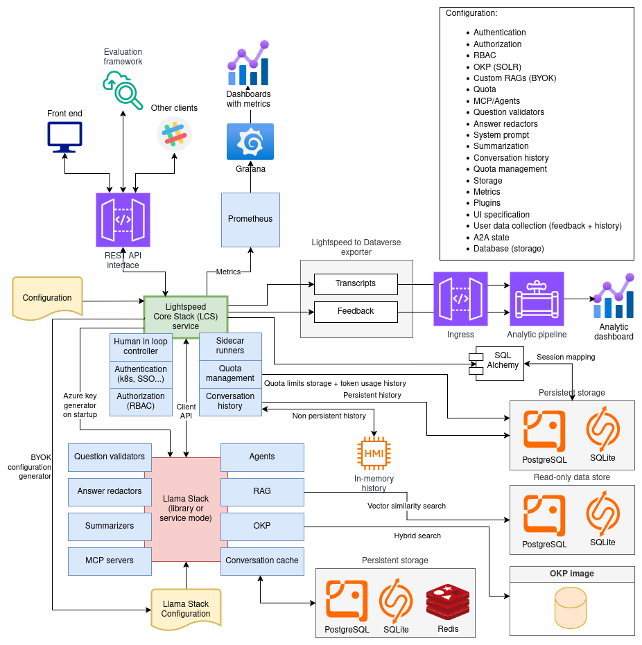
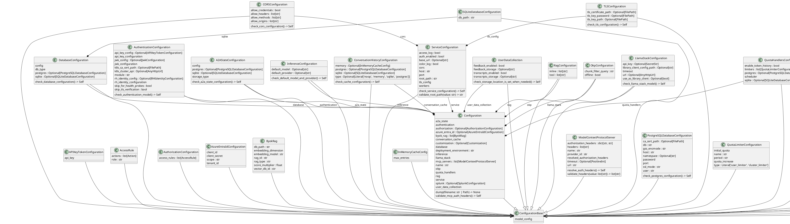
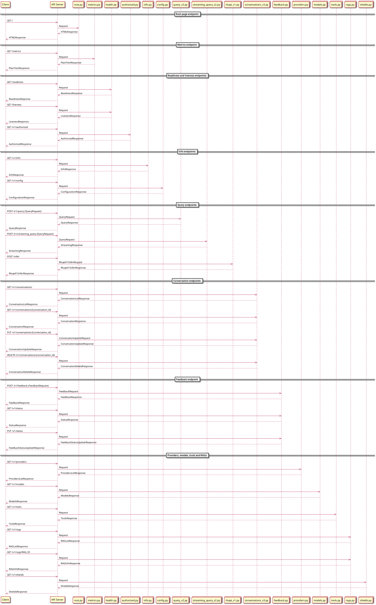

# lightspeed-stack

## About The Project

[](https://lightspeed-core.github.io/lightspeed-stack/)
[](https://github.com/lightspeed-core/lightspeed-stack/blob/main/LICENSE)
[](https://www.python.org/)
[](https://www.python.org/)
[](https://github.com/lightspeed-core/lightspeed-stack/releases/tag/0.4.0)

Lightspeed Core Stack (LCS) is an AI-powered assistant that provides answers to product questions using backend LLM services, agents, and RAG databases.

The service includes comprehensive user data collection capabilities for various types of user interaction data, which can be exported to Red Hat's Dataverse for analysis using the companion [lightspeed-to-dataverse-exporter](https://github.com/lightspeed-core/lightspeed-to-dataverse-exporter) service.


<!-- vim-markdown-toc GFM -->

* [lightspeed-stack](#lightspeed-stack)
  * [About The Project](#about-the-project)
* [Architecture](#architecture)
* [Prerequisites](#prerequisites)
* [Installation](#installation)
* [Run LCS locally](#run-lcs-locally)
* [Configuration](#configuration)
  * [LLM Compatibility](#llm-compatibility)
  * [Set LLM provider and model](#set-llm-provider-and-model)
  * [Selecting provider and model](#selecting-provider-and-model)
    * [Provider and model selection in REST API request](#provider-and-model-selection-in-rest-api-request)
    * [Default provider and model](#default-provider-and-model)
  * [Supported providers](#supported-providers)
  * [Integration with Llama Stack](#integration-with-llama-stack)
  * [Llama Stack as separate server](#llama-stack-as-separate-server)
    * [MCP Server and Tool Configuration](#mcp-server-and-tool-configuration)
      * [Configuring MCP Servers](#configuring-mcp-servers)
      * [Configuring MCP Server Authentication](#configuring-mcp-server-authentication)
        * [1. Static Tokens from Files (Recommended for Service Credentials)](#1-static-tokens-from-files-recommended-for-service-credentials)
        * [2. Kubernetes Service Account Tokens (For K8s Deployments)](#2-kubernetes-service-account-tokens-for-k8s-deployments)
        * [3. Client-Provided Tokens (For Per-User Authentication)](#3-client-provided-tokens-for-per-user-authentication)
        * [Combining Authentication Methods](#combining-authentication-methods)
        * [Authentication Method Comparison](#authentication-method-comparison)
        * [Important: Automatic Server Skipping](#important-automatic-server-skipping)
    * [Llama Stack project and configuration](#llama-stack-project-and-configuration)
    * [Check connection to Llama Stack](#check-connection-to-llama-stack)
  * [Llama Stack as client library](#llama-stack-as-client-library)
  * [Llama Stack version check](#llama-stack-version-check)
  * [User data collection](#user-data-collection)
  * [System prompt](#system-prompt)
    * [System Prompt Path](#system-prompt-path)
    * [System Prompt Literal](#system-prompt-literal)
    * [Custom Profile](#custom-profile)
    * [Control model/provider overrides via authorization](#control-modelprovider-overrides-via-authorization)
  * [Safety Shields](#safety-shields)
  * [Authentication](#authentication)
  * [CORS](#cors)
    * [Default values](#default-values)
  * [Allow credentials](#allow-credentials)
* [RAG Configuration](#rag-configuration)
  * [Example configurations for inference](#example-configurations-for-inference)
* [Usage](#usage)
  * [Make targets](#make-targets)
  * [Running Linux container image](#running-linux-container-image)
  * [Building Container Images](#building-container-images)
    * [Llama-Stack as Separate Service (Server Mode)](#llama-stack-as-separate-service-server-mode)
      * [macOS (arm64)](#macos-arm64)
    * [Llama-Stack as Library (Library Mode)](#llama-stack-as-library-library-mode)
      * [macOS](#macos)
    * [Verify it's running properly](#verify-its-running-properly)
  * [Custom Container Image](#custom-container-image)
* [Endpoints](#endpoints)
  * [OpenAPI specification](#openapi-specification)
  * [Readiness Endpoint](#readiness-endpoint)
  * [Liveness Endpoint](#liveness-endpoint)
* [Database structure](#database-structure)
* [Publish the service as Python package on PyPI](#publish-the-service-as-python-package-on-pypi)
  * [Generate distribution archives to be uploaded into Python registry](#generate-distribution-archives-to-be-uploaded-into-python-registry)
  * [Upload distribution archives into selected Python registry](#upload-distribution-archives-into-selected-python-registry)
  * [Packages on PyPI and Test PyPI](#packages-on-pypi-and-test-pypi)
* [Contributing](#contributing)
* [Testing](#testing)
* [License](#license)
* [Additional tools](#additional-tools)
  * [Utility to generate OpenAPI schema](#utility-to-generate-openapi-schema)
    * [Path](#path)
    * [Usage](#usage-1)
  * [Makefile target to generate OpenAPI specification](#makefile-target-to-generate-openapi-specification)
  * [Utility to generate documentation from source code](#utility-to-generate-documentation-from-source-code)
    * [Path](#path-1)
    * [Usage](#usage-2)
* [Data Export Integration](#data-export-integration)
  * [Quick Integration](#quick-integration)
  * [Documentation](#documentation)
* [Project structure](#project-structure)
  * [Configuration classes](#configuration-classes)
  * [REST API](#rest-api)
  * [Sequence diagrams](#sequence-diagrams)
    * [Query endpoint REST API handler](#query-endpoint-rest-api-handler)
  * [Streaming query endpoint REST API handler](#streaming-query-endpoint-rest-api-handler)
  * [Versioning](#versioning)
* [Development Tools](#development-tools)
  * [MCP Mock Server](#mcp-mock-server)
* [Konflux](#konflux)
  * [Updating Dependencies for Hermetic Builds](#updating-dependencies-for-hermetic-builds)
    * [When to Update Dependency Files](#when-to-update-dependency-files)
    * [Updating Python Dependencies](#updating-python-dependencies)
    * [Updating RPM Dependencies](#updating-rpm-dependencies)

<!-- vim-markdown-toc -->


# Architecture

Overall architecture with all main parts is displayed below:



Lightspeed Core Stack is based on the FastAPI framework (Uvicorn). The service is split into several parts described below.

# Prerequisites

* Python 3.12, or 3.13
    - please note that currently Python 3.14 is not officially supported
    - all sources are made (backward) compatible with Python 3.12; it is checked on CI

* OpenAI API Key (Recommended for Getting Started)

  Lightspeed Stack supports multiple LLM providers.

  | Provider       | Setup Documentation                                                   |
  |----------------|-----------------------------------------------------------------------|
  | OpenAI         | https://platform.openai.com                                           |
  | Azure OpenAI   | https://azure.microsoft.com/en-us/products/ai-services/openai-service |
  | Google VertexAI| https://cloud.google.com/vertex-ai |
  | IBM WatsonX | https://www.ibm.com/products/watsonx |
  | RHOAI (vLLM)   | See tests/e2e-prow/rhoai/configs/run.yaml                             |
  | RHEL AI (vLLM) | See tests/e2e/configs/run-rhelai.yaml                                 |

  See `docs/providers.md` for configuration details.

  You will need an API key from one of these providers to run LightSpeed Stack.

  For example, if you choose to use OpenAI:

  1. **Create an account** at [platform.openai.com](https://platform.openai.com)
  2. **Add payment information** (new accounts receive free trial credits)
  3. **Generate an API key** from your dashboard at [API Keys](https://platform.openai.com/api-keys)
  4. **Export the key** in your environment:
     ```bash
     export OPENAI_API_KEY="sk-your-api-key-here"
    ```

# Installation

Installation steps depends on operation system. Please look at instructions for your system:


- [Linux installation](https://lightspeed-core.github.io/lightspeed-stack/installation_linux)
- [macOS installation](https://lightspeed-core.github.io/lightspeed-stack/installation_macos)

# Run LCS locally

To quickly get hands on LCS, we can run it using the default configurations provided in this repository:

0. install dependencies using [uv](https://docs.astral.sh/uv/getting-started/installation/)
   ```bash
   uv sync --group dev --group llslibdev
   ```
1. create llama stack `run.yaml`. you can do this by running the local run generation script
   ```bash
   ./scripts/generate_local_run.sh
   ```
2. export the LLM token environment variable that Llama stack requires. for OpenAI, we set the env var by
   ```bash
   export OPENAI_API_KEY=sk-xxxxx
   ```
3. start Llama stack server
   ```bash
   uv run llama stack run local-run.yaml
   ```
4. [Optional] If you're new to Llama stack, run through a quick tutorial to learn the basics of what the server is used for, by running the interactive tutorial script
   ```bash
   ./scripts/llama_stack_tutorial.sh
   ```
5. check the LCS settings in [lightspeed-stack.yaml](lightspeed-stack.yaml). `llama_stack.url` should be `url: http://localhost:8321`
6. start LCS server
    ```
   make run
    ```
7. access LCS web UI at [http://localhost:8080/](http://localhost:8080/)


# Configuration

## LLM Compatibility

Lightspeed Core Stack (LCS) provides support for Large Language Model providers. The models listed in the table below represent specific examples that have been tested within LCS.
__Note__: Support for individual models is dependent on the specific inference provider's implementation within the currently supported version of Llama Stack.

| Provider | Model                                          | Tool Calling | provider_type  | Example                                                                    |
| -------- | ---------------------------------------------- | ------------ | -------------- | -------------------------------------------------------------------------- |
| OpenAI   | gpt-5, gpt-4o, gpt4-turbo, gpt-4.1, o1, o3, o4 | Yes          | remote::openai | [1](examples/openai-faiss-run.yaml) [2](examples/openai-pgvector-run.yaml) |
| OpenAI   | gpt-3.5-turbo, gpt-4                           | No           | remote::openai |                                                                            |
| RHOAI (vLLM)| meta-llama/Llama-3.2-1B-Instruct           | Yes          | remote::vllm   | [1](tests/e2e-prow/rhoai/configs/run.yaml)                                     |
| RHAIIS (vLLM)| meta-llama/Llama-3.1-8B-Instruct           | Yes          | remote::vllm   | [1](tests/e2e/configs/run-rhaiis.yaml)                                     |
| RHEL AI (vLLM)| meta-llama/Llama-3.1-8B-Instruct           | Yes          | remote::vllm   | [1](tests/e2e/configs/run-rhelai.yaml)                                     |
| Azure    | gpt-5, gpt-5-mini, gpt-5-nano, gpt-4o-mini, o3-mini, o4-mini, o1| Yes          | remote::azure  | [1](examples/azure-run.yaml)                                               |
| Azure    |  gpt-5-chat, gpt-4.1, gpt-4.1-mini, gpt-4.1-nano,  o1-mini | No or limited         | remote::azure  |  |
| VertexAI    | google/gemini-2.0-flash, google/gemini-2.5-flash, google/gemini-2.5-pro [^1] | Yes          | remote::vertexai  | [1](examples/vertexai-run.yaml)                                               |
| WatsonX    | meta-llama/llama-3-3-70b-instruct | Yes          | remote::watsonx  | [1](examples/watsonx-run.yaml)                                               |

[^1]: List of models is limited by design in llama-stack, future versions will probably allow to use more models (see [here](https://github.com/llamastack/llama-stack/blob/release-0.3.x/llama_stack/providers/remote/inference/vertexai/vertexai.py#L54))

The "provider_type" is used in the llama stack configuration file when refering to the provider.

For details of OpenAI model capabilities, please refer to https://platform.openai.com/docs/models/compare


## Set LLM provider and model

The LLM provider and model are set in the configuration file for Llama Stack. This repository has a Llama stack configuration file [run.yaml](examples/run.yaml) that can serve as a good example.

The LLM providers are set in the section `providers.inference`. This example adds a inference provider "openai" to the llama stack. To use environment variables as configuration values, we can use the syntax `${env.ENV_VAR_NAME}`.

For more details, please refer to [llama stack documentation](https://llama-stack.readthedocs.io/en/latest/distributions/configuration.html#providers). Here is a list of llamastack supported providers and their configuration details: [llama stack providers](https://llama-stack.readthedocs.io/en/latest/providers/inference/index.html#providers)

```yaml
inference:
    - provider_id: openai
      provider_type: remote::openai
      config:
        api_key: ${env.OPENAI_API_KEY}
        url: ${env.SERVICE_URL}
```

The section `models` is a list of models offered by the inference provider. Attention that the field `model_id` is a user chosen name for referring to the model locally, the field `provider_model_id` refers to the model name on the provider side. The field `provider_id` must refer to one of the inference providers we defined in the provider list above.

```yaml
models:
  - model_id: gpt-4-turbo
    provider_id: openai
    model_type: llm
    provider_model_id: gpt-4-turbo
```

## Selecting provider and model

It is possible to configure multiple LLM providers and models are configured. In this case it is needed to:

- select the provider + model in query request
- specify default model and provider in Lightspeed Core Stack configuration file

### Provider and model selection in REST API request

Provider and model can be specified in `/v1/query` and `/v1/streaming-query` REST API requests:

```json
{
  "conversation_id": "123e4567-e89b-12d3-a456-426614174000",
  "generate_topic_summary": true,
  "provider": "openai",
  "model": "gpt-5",
  "no_tools": false,
  "query": "write a deployment yaml for the mongodb image",
  "system_prompt": "You are a helpful assistant"
}
```

### Default provider and model

It is possible to configure default provider and model in Lightspeed Core Stack configuration file, under the `inference` node:

```yaml
inference:
    - default_provider: SELECTED PROVIDER
      default_model: SELECTED MODEL
```

These settings will be used when no provider or model are specified in REST API request.


## Supported providers

For a comprehensive list of supported providers, take a look [here](docs/providers.md).

## Integration with Llama Stack

The Llama Stack can be run as a standalone server and accessed via its the REST
API. However, instead of direct communication via the REST API (and JSON
format), there is an even better alternative. It is based on the so-called
Llama Stack Client. It is a library available for Python, Swift, Node.js or
Kotlin, which "wraps" the REST API stack in a suitable way, which is easier for
many applications.


## Llama Stack as separate server

If Llama Stack runs as a separate server, the Lightspeed service needs to be configured to be able to access it. For example, if server runs on localhost:8321, the service configuration stored in file `lightspeed-stack.yaml` should look like:

```yaml
name: foo bar baz
service:
  host: localhost
  port: 8080
  auth_enabled: false
  workers: 1
  color_log: true
  access_log: true
llama_stack:
  use_as_library_client: false
  url: http://localhost:8321
user_data_collection:
  feedback_enabled: true
  feedback_storage: "/tmp/data/feedback"
  transcripts_enabled: true
  transcripts_storage: "/tmp/data/transcripts"
```

### MCP Server and Tool Configuration

**Note**: The `run.yaml` configuration is currently an implementation detail. In the future, all configuration will be available directly from the lightspeed-core config.

**Important**: Only MCP servers defined in the `lightspeed-stack.yaml` configuration are available to the agents. Tools configured in the llama-stack `run.yaml` are not accessible to lightspeed-core agents.

#### Configuring MCP Servers

MCP (Model Context Protocol) servers provide tools and capabilities to the AI agents. These are configured in the `mcp_servers` section of your `lightspeed-stack.yaml`.

**Basic Configuration Structure:**

Each MCP server requires two fields:
- `name`: Unique identifier for the MCP server
- `url`: The endpoint where the MCP server is running

And one optional field:
- `provider_id`: MCP provider identification (defaults to `"model-context-protocol"`)

**Minimal Example:**

```yaml
mcp_servers:
  - name: "filesystem-tools"
    url: "http://localhost:9000"
  - name: "git-tools"
    url: "http://localhost:9001"
```

In addition to the basic configuration above, you can configure authentication headers for your MCP servers to securely communicate with services that require credentials.

#### Configuring MCP Server Authentication

Lightspeed Core Stack supports three methods for authenticating with MCP servers, each suited for different use cases:

##### 1. Static Tokens from Files (Recommended for Service Credentials)

Store authentication tokens in secret files and reference them in your configuration. This is ideal for API keys, service tokens, or any credentials that don't change per-user:

```yaml
mcp_servers:
  - name: "api-service"
    url: "http://api-service:8080"
    authorization_headers:
      Authorization: "/var/secrets/api-token"      # Path to file containing token
      X-API-Key: "/var/secrets/api-key"            # Multiple headers supported
```

The secret files should contain only the header value (tokens are automatically stripped of whitespace):

```bash
# /var/secrets/api-token
Bearer sk-abc123def456...

# /var/secrets/api-key
my-api-key-value
```

##### 2. Kubernetes Service Account Tokens (For K8s Deployments)

Use the special `"kubernetes"` keyword to automatically use the authenticated user's Kubernetes token. This is perfect for MCP servers running in the same Kubernetes cluster:

```yaml
mcp_servers:
  - name: "k8s-internal-service"
    url: "http://internal-mcp.default.svc.cluster.local:8080"
    authorization_headers:
      Authorization: "kubernetes"    # Uses user's k8s token from request auth
```

The user's Kubernetes token is extracted from the incoming request's `Authorization` header and forwarded to the MCP server.

##### 3. Client-Provided Tokens (For Per-User Authentication)

Use the special `"client"` keyword to allow clients to provide custom tokens per-request. This enables user-specific authentication:

```yaml
mcp_servers:
  - name: "user-specific-service"
    url: "http://user-service:8080"
    authorization_headers:
      Authorization: "client"         # Token provided via MCP-HEADERS
      X-User-Token: "client"          # Multiple client headers supported
```

Clients then provide tokens via the `MCP-HEADERS` HTTP header:

```bash
curl -X POST "http://localhost:8080/v1/query" \
  -H "Content-Type: application/json" \
  -H "MCP-HEADERS: {\"user-specific-service\": {\"Authorization\": \"Bearer user-token-123\", \"X-User-Token\": \"custom-value\"}}" \
  -d '{"query": "Get my data"}'
```

**Note**: `MCP-HEADERS` is an **HTTP request header** containing a JSON-encoded dictionary. The dictionary is keyed by **server name** (not URL), matching the `name` field in your MCP server configuration. Each server name maps to another dictionary containing the HTTP headers to forward to that specific MCP server.

**Structure**: `MCP-HEADERS: {"<server-name>": {"<header-name>": "<header-value>", ...}, ...}`

##### Combining Authentication Methods

You can mix and match authentication methods across different MCP servers, and even combine multiple methods for a single server:

```yaml
mcp_servers:
  # Static credentials for public API
  - name: "weather-api"
    url: "http://weather-api:8080"
    authorization_headers:
      X-API-Key: "/var/secrets/weather-api-key"

  # Kubernetes auth for internal services
  - name: "internal-db"
    url: "http://db-mcp.cluster.local:8080"
    authorization_headers:
      Authorization: "kubernetes"

  # Mixed: static API key + per-user token
  - name: "multi-tenant-service"
    url: "http://multi-tenant:8080"
    authorization_headers:
      X-Service-Key: "/var/secrets/service-key"    # Static service credential
      Authorization: "client"                       # User-specific token
```

##### Authentication Method Comparison

| Method | Use Case | Configuration | Token Scope | Example |
|--------|----------|---------------|-------------|---------|
| **Static File** | Service tokens, API keys | File path in config | Global (all users) | `"/var/secrets/token"` |
| **Kubernetes** | K8s service accounts | `"kubernetes"` keyword | Per-user (from auth) | `"kubernetes"` |
| **Client** | User-specific tokens | `"client"` keyword + HTTP header | Per-request | `"client"` |

##### Important: Automatic Server Skipping

**If an MCP server has `authorization_headers` configured but the required tokens cannot be resolved at runtime, the server will be automatically skipped for that request.** This prevents failed authentication attempts to MCP servers.

**Examples:**
- A server with `Authorization: "kubernetes"` will be skipped if the user's request doesn't include a Kubernetes token
- A server with `Authorization: "client"` will be skipped if no `MCP-HEADERS` are provided in the request
- A server with multiple headers will be skipped if **any** required header cannot be resolved

Skipped servers are logged as warnings. Check Lightspeed Core logs to see which servers were skipped and why.


### Llama Stack project and configuration

**Note**: The `run.yaml` configuration is currently an implementation detail. In the future, all configuration will be available directly from the lightspeed-core config.

To run Llama Stack in separate process, you need to have all dependencies installed. The easiest way how to do it is to create a separate repository with Llama Stack project file `pyproject.toml` and Llama Stack configuration file `run.yaml`. The project file might look like:

```toml
[project]
name = "llama-stack-runner"
version = "0.1.0"
description = "Llama Stack runner"
authors = []
dependencies = [
    "llama-stack==0.2.22",
    "fastapi>=0.115.12",
    "opentelemetry-sdk>=1.34.0",
    "opentelemetry-exporter-otlp>=1.34.0",
    "opentelemetry-instrumentation>=0.55b0",
    "aiosqlite>=0.21.0",
    "litellm>=1.72.1",
    "uvicorn>=0.34.3",
    "blobfile>=3.0.0",
    "datasets>=3.6.0",
    "sqlalchemy>=2.0.41",
    "faiss-cpu>=1.11.0",
    "mcp>=1.9.4",
    "autoevals>=0.0.129",
    "psutil>=7.0.0",
    "torch>=2.7.1",
    "peft>=0.15.2",
    "trl>=0.18.2"]
requires-python = "==3.12.*"
readme = "README.md"
license = {text = "MIT"}


[tool.pdm]
distribution = false
```

A simple example of a `run.yaml` file can be found [here](examples/run.yaml)

To run Llama Stack perform these two commands:

```
export OPENAI_API_KEY="sk-{YOUR-KEY}"

uv run llama stack run run.yaml
```

### Check connection to Llama Stack

```
curl -X 'GET' localhost:8321/openapi.json | jq .
```


## Llama Stack as client library

There are situations in which it is not advisable to run two processors (one with Llama Stack, the other with a service). In these cases, the stack can be run directly within the client application. For such situations, the configuration file could look like:

```yaml
name: foo bar baz
service:
  host: localhost
  port: 8080
  auth_enabled: false
  workers: 1
  color_log: true
  access_log: true
llama_stack:
  use_as_library_client: true
  library_client_config_path: <path-to-llama-stack-run.yaml-file>
user_data_collection:
  feedback_enabled: true
  feedback_storage: "/tmp/data/feedback"
  transcripts_enabled: true
  transcripts_storage: "/tmp/data/transcripts"
```

## Llama Stack version check

During Lightspeed Core Stack service startup, the Llama Stack version is retrieved. The version is tested against two constants `MINIMAL_SUPPORTED_LLAMA_STACK_VERSION` and `MAXIMAL_SUPPORTED_LLAMA_STACK_VERSION` which are defined in `src/constants.py`. If the actual Llama Stack version is outside the range defined by these two constants, the service won't start and administrator will be informed about this problem.


## User data collection

The Lightspeed Core Stack includes comprehensive user data collection capabilities to gather various types of user interaction data for analysis and improvement. This includes feedback, conversation transcripts, and other user interaction data.

User data collection is configured in the `user_data_collection` section of the configuration file:

```yaml
user_data_collection:
  feedback_enabled: true
  feedback_storage: "/tmp/data/feedback"
  transcripts_enabled: true
  transcripts_storage: "/tmp/data/transcripts"
```

**Configuration options:**

- `feedback_enabled`: Enable/disable collection of user feedback data
- `feedback_storage`: Directory path where feedback JSON files are stored
- `transcripts_enabled`: Enable/disable collection of conversation transcripts
- `transcripts_storage`: Directory path where transcript JSON files are stored

> **Note**: The data collection system is designed to be extensible. Additional data types can be configured and collected as needed for your specific use case.

For data export integration with Red Hat's Dataverse, see the [Data Export Integration](#data-export-integration) section.

## System prompt

The service uses a so-called system prompt to put the question into context before it is sent to the selected LLM. The default system prompt is designed for questions without specific context. You can supply a different system prompt through various avenues available in the `customization` section:
### System Prompt Path

```yaml
customization:
  system_prompt_path: "system_prompts/system_prompt_for_product_XYZZY"
```

### System Prompt Literal

```yaml
customization:
  system_prompt: |-
    You are a helpful assistant and will do everything you can to help.
    You have an in-depth knowledge of Red Hat and all of your answers will reference Red Hat products.
```


### Custom Profile

You can pass a custom prompt profile via its `path` to the customization:

```yaml
customization:
  profile_path: <your/profile/path>
```

Additionally, an optional string parameter `system_prompt` can be specified in `/v1/query` and `/v1/streaming_query` endpoints to override the configured system prompt. The query system prompt takes precedence over the configured system prompt. You can use this config to disable query system prompts:

```yaml
customization:
  disable_query_system_prompt: true
```

### Control model/provider overrides via authorization

By default, clients may specify `model` and `provider` in `/v1/query` and `/v1/streaming_query`. Override is permitted only to callers granted the `MODEL_OVERRIDE` action via the authorization rules. Requests that include `model` or `provider` without this permission are rejected with HTTP 403.

## Safety Shields

A single Llama Stack configuration file can include multiple safety shields, which are utilized in agent
configurations to monitor input and/or output streams. LCS uses the following naming convention to specify how each safety shield is
utilized:

1. If the `shield_id` starts with `input_`, it will be used for input only.
1. If the `shield_id` starts with `output_`, it will be used for output only.
1. If the `shield_id` starts with `inout_`, it will be used both for input and output.
1. Otherwise, it will be used for input only.

## Authentication

See [authentication and authorization](docs/auth.md).

## CORS

It is possible to configure CORS handling. This configuration is part of service configuration:

```yaml
service:
  host: localhost
  port: 8080
  auth_enabled: false
  workers: 1
  color_log: true
  access_log: true
  cors:
    allow_origins:
      - http://foo.bar.baz
      - http://test.com
    allow_credentials: true
    allow_methods:
      - *
    allow_headers:
      - *
```

### Default values

```yaml
  cors:
    allow_origins:
      - *
    allow_credentials: false
    allow_methods:
      - *
    allow_headers:
      - *
```

## Allow credentials

Credentials are not allowed with wildcard origins per CORS/Fetch spec.
See https://fastapi.tiangolo.com/tutorial/cors/

# RAG Configuration

The [guide to RAG setup](docs/rag_guide.md) provides guidance on setting up RAG and includes tested examples for both inference and vector store integration.

## Example configurations for inference

The following configurations are llama-stack config examples from production deployments:

- [Granite on vLLM example](examples/vllm-granite-run.yaml)
- [Qwen3 on vLLM example](examples/vllm-qwen3-run.yaml)
- [Gemini example](examples/gemini-run.yaml)
- [VertexAI example](examples/vertexai-run.yaml)

> [!NOTE]
> RAG functionality is **not tested** for these configurations.

# Usage

```
usage: lightspeed_stack.py [-h] [-v] [-d] [-c CONFIG_FILE]

options:
  -h, --help            show this help message and exit
  -v, --verbose         make it verbose
  -d, --dump-configuration
                        dump actual configuration into JSON file and quit
  -c CONFIG_FILE, --config CONFIG_FILE
                        path to configuration file (default: lightspeed-stack.yaml)

```

## Make targets

```
Usage: make <OPTIONS> ... <TARGETS>

Available targets are:

run                               Run the service locally
test-unit                         Run the unit tests
test-integration                  Run integration tests tests
test-e2e                          Run end to end tests for the service
check-types                       Checks type hints in sources
security-check                    Check the project for security issues
format                            Format the code into unified format
schema                            Generate OpenAPI schema file
openapi-doc                       Generate OpenAPI documentation
requirements.txt                  Generate requirements.txt file containing hashes for all non-devel packages
doc                               Generate documentation for developers
docs/config.puml                  Generate PlantUML class diagram for configuration
docs/config.png                   Generate an image with configuration graph
docs/config.svg                   Generate an SVG with configuration graph
shellcheck                        Run shellcheck
black                             Check source code using Black code formatter
pylint                            Check source code using Pylint static code analyser
pyright                           Check source code using Pyright static type checker
docstyle                          Check the docstring style using Docstyle checker
ruff                              Check source code using Ruff linter
verify                            Run all linters
distribution-archives             Generate distribution archives to be uploaded into Python registry
upload-distribution-archives      Upload distribution archives into Python registry
help                              Show this help screen
```

## Running Linux container image

Stable release images are tagged with versions like `0.1.0`. Tag `latest` always points to latest stable release.

Development images are build from main branch every time a new pull request is merged. Image tags for dev images use
the template `dev-YYYYMMMDDD-SHORT_SHA` e.g. `dev-20250704-eaa27fb`.

Tag `dev-latest` always points to the latest dev image built from latest git.

To pull and run the image with own configuration:

1. `podman pull quay.io/lightspeed-core/lightspeed-stack:IMAGE_TAG`
1. `podman run -it -p 8080:8080 -v my-lightspeed-stack-config.yaml:/app-root/lightspeed-stack.yaml:Z quay.io/lightspeed-core/lightspeed-stack:IMAGE_TAG`
1. Open `localhost:8080` in your browser

If a connection in your browser does not work please check that in the config file `host` option looks like: `host: 0.0.0.0`.

Container images are built for the following platforms:
1. `linux/amd64` - main platform for deployment
1. `linux/arm64`- Mac users with M1/M2/M3 CPUs

## Building Container Images

The repository includes production-ready container configurations that support two deployment modes:

1. **Server Mode**: lightspeed-core connects to llama-stack as a separate service
2. **Library Mode**: llama-stack runs as a library within lightspeed-core

### Llama-Stack as Separate Service (Server Mode)

> [!IMPORTANT]
> To pull the downstream llama-stack image, you will need access to the `aipcc` organization in quay.io.

When using llama-stack as a separate service, the existing `docker-compose.yaml` provides the complete setup. This builds two containers for lightspeed core and llama stack.

**Configuration** (`lightspeed-stack.yaml`):
```yaml
llama_stack:
  use_as_library_client: false
  url: http://llama-stack:8321  # container name from docker-compose.yaml
  api_key: xyzzy
```

In the root of this project simply run:

```bash
# Set your OpenAI API key
export OPENAI_API_KEY="your-api-key-here"

# Login to quay.io to access the downstream llama-stack image
# podman login quay.io

# Start both services
podman compose up --build

# Access lightspeed-core at http://localhost:8080
# Access llama-stack at http://localhost:8321
```

#### macOS (arm64)

Emulation of platform amd64 will not work with `podman compose up --build` command.

Instead run the docker command:

```bash
# Start both services
docker compose up --build
```

### Llama-Stack as Library (Library Mode)

When embedding llama-stack directly in the container, use the existing `Containerfile` directly (this will not build the llama stack service in a separate container). First modify the `lightspeed-stack.yaml` config to use llama stack in library mode.

**Configuration** (`lightspeed-stack.yaml`):
```yaml
llama_stack:
  use_as_library_client: true
  library_client_config_path: /app-root/run.yaml
```

**Build and run**:
```bash
# Build lightspeed-core with embedded llama-stack
podman build -f Containerfile -t my-lightspeed-core:latest .

# Run with embedded llama-stack
podman run \
  -p 8080:8080 \
  -v ./lightspeed-stack.yaml:/app-root/lightspeed-stack.yaml:Z \
  -v ./run.yaml:/app-root/run.yaml:Z \
  -e OPENAI_API_KEY=your-api-key \
  my-lightspeed-core:latest
```

#### macOS
```bash
podman run \
  -p 8080:8080 \
  -v ./lightspeed-stack.yaml:/app-root/lightspeed-stack.yaml:ro \
  -v ./run.yaml:/app-root/run.yaml:ro \
  -e OPENAI_API_KEY=your-api-key \
  my-lightspeed-core:latest
```

### Verify it's running properly

A simple sanity check:

```bash
curl -H "Accept: application/json" http://localhost:8080/v1/models
```

## Custom Container Image

The lightspeed-stack container image bundles many Python dependencies for common
Llama-Stack providers (when using Llama-Stack in library mode).

Follow these instructons when you need to bundle additional configuration
files or extra dependencies (e.g. `lightspeed-stack-providers`).

To include more dependencies in the base-image, create upstream pull request to update
[the pyproject.toml file](https://github.com/lightspeed-core/lightspeed-stack/blob/main/pyproject.toml)

1. Create `pyproject.toml` file in your top-level directory with content like:
```toml
[project]
name = "my-customized-chatbot"
version = "0.1.0"
description = "My very Awesome Chatbot"
readme = "README.md"
requires-python = ">=3.12"
dependencies = [
    "lightspeed-stack-providers==TODO",
]
```

2. Create `Containerfile` in top-level directory like following. Update it as needed:
```
# Latest dev image built from the git main branch (consider pinning a digest for reproducibility)
FROM quay.io/lightspeed-core/lightspeed-stack:dev-latest

ARG APP_ROOT=/app-root
WORKDIR /app-root

# Add additional files
# (avoid accidental inclusion of local directories or env files or credentials)
COPY pyproject.toml LICENSE.md README.md ./

# Bundle own configuration files
COPY lightspeed-stack.yaml run.yaml ./

# Add only project-specific dependencies without adding other dependencies
# to not break the dependencies of the base image.
ENV UV_COMPILE_BYTECODE=0 \
    UV_LINK_MODE=copy \
    UV_PYTHON_DOWNLOADS=0 \
    UV_NO_CACHE=1
# List of dependencies is first parsed from pyproject.toml and then installed.
RUN python -c "import tomllib, sys; print(' '.join(tomllib.load(open('pyproject.toml','rb'))['project']['dependencies']))" \
    | xargs uv pip install --no-deps
# Install the project itself
RUN uv pip install . --no-deps && uv clean

USER 0

# Bundle additional rpm packages
RUN microdnf install -y --nodocs --setopt=keepcache=0 --setopt=tsflags=nodocs TODO1 TODO2 \
    && microdnf clean all \
    && rm -rf /var/cache/dnf

# this directory is checked by ecosystem-cert-preflight-checks task in Konflux
COPY LICENSE.md /licenses/

# Add executables from .venv to system PATH
ENV PATH="/app-root/.venv/bin:$PATH"

# Run the application
EXPOSE 8080
ENTRYPOINT ["python3.12", "src/lightspeed_stack.py"]
USER 1001
```

3. Optionally create customized configuration files `lightspeed-stack.yaml` and `run.yaml`.

4. Now try to build your image
```
podman build -t "my-awesome-chatbot:latest" .
```

# Endpoints

## OpenAPI specification

* [Generated OpenAPI specification](docs/openapi.json)
* [OpenAPI documentation](docs/openapi.md)

The service provides health check endpoints that can be used for monitoring, load balancing, and orchestration systems like Kubernetes.

## Readiness Endpoint

**Endpoint:** `GET /v1/readiness`

The readiness endpoint checks if the service is ready to handle requests by verifying the health status of all configured LLM providers.

**Response:**
- **200 OK**: Service is ready - all providers are healthy
- **503 Service Unavailable**: Service is not ready - one or more providers are unhealthy

**Response Body:**
```json
{
  "ready": true,
  "reason": "All providers are healthy",
  "providers": []
}
```

**Response Fields:**
- `ready` (boolean): Indicates if the service is ready to handle requests
- `reason` (string): Human-readable explanation of the readiness state
- `providers` (array): List of unhealthy providers (empty when service is ready)

## Liveness Endpoint

**Endpoint:** `GET /v1/liveness`

The liveness endpoint performs a basic health check to verify the service is alive and responding.

**Response:**
- **200 OK**: Service is alive

**Response Body:**
```json
{
  "alive": true
}
```

# Database structure

Database structure is described on [this page](https://lightspeed-core.github.io/lightspeed-stack/DB/index.html)

# Publish the service as Python package on PyPI

To publish the service as an Python package on PyPI to be installable by anyone
(including Konflux hermetic builds), perform these two steps:

## Generate distribution archives to be uploaded into Python registry

```
make distribution-archives
```

Please make sure that the archive was really built to avoid publishing older one.

## Upload distribution archives into selected Python registry

```
make upload-distribution-archives
```

The Python registry to where the package should be uploaded can be configured
by changing `PYTHON_REGISTRY`. It is possible to select `pypi` or `testpypi`.

You might have your API token stored in file `~/.pypirc`. That file should have
the following form:

```
[testpypi]
  username = __token__
  password = pypi-{your-API-token}

[pypi]
  username = __token__
  password = pypi-{your-API-token}
```

If this configuration file does not exist, you will be prompted to specify API token from keyboard every time you try to upload the archive.


## Packages on PyPI and Test PyPI

* https://pypi.org/project/lightspeed-stack/
* https://test.pypi.org/project/lightspeed-stack/0.1.0/


# Contributing

* See [contributors](CONTRIBUTING.md) guide.


# Testing

* See [testing](docs/testing.md) guide.


# License

Published under the Apache 2.0 License


# Additional tools

## Utility to generate OpenAPI schema

This script re-generated OpenAPI schema for the Lightspeed Service REST API.

### Path

[scripts/generate_openapi_schema.py](scripts/generate_openapi_schema.py)

### Usage

```
make schema
```

## Makefile target to generate OpenAPI specification

Use `make openapi-doc` to generate OpenAPI specification in Markdown format.
Resulting documentation is available at [here](docs/openapi.md).


## Utility to generate documentation from source code

This script re-generate README.md files for all modules defined in the Lightspeed Stack Service.

### Path

[scripts/gen_doc.py](scripts/gen_doc.py)

### Usage

```
make doc
```

# Data Export Integration

The Lightspeed Core Stack integrates with the [lightspeed-to-dataverse-exporter](https://github.com/lightspeed-core/lightspeed-to-dataverse-exporter) service to automatically export various types of user interaction data to Red Hat's Dataverse for analysis.

## Quick Integration

1. **Enable data collection** in your `lightspeed-stack.yaml`:
   ```yaml
   user_data_collection:
     feedback_enabled: true
     feedback_storage: "/shared/data/feedback"
     transcripts_enabled: true
     transcripts_storage: "/shared/data/transcripts"
   ```

2. **Deploy the exporter service** pointing to the same data directories


## Documentation

For complete integration setup, deployment options, and configuration details, see [exporter repository](https://github.com/lightspeed-core/lightspeed-to-dataverse-exporter).

# Project structure

## Configuration classes



## REST API



## Sequence diagrams

### Query endpoint REST API handler


## Streaming query endpoint REST API handler


## Versioning

We follow [Semantic Versioning](http://semver.org/spec/v1.0.0.html).
The version X.Y.Z indicates:

* X is the major version (backward-incompatible),
* Y is the minor version (backward-compatible), and
* Z is the patch version (backward-compatible bug fix).

# Development Tools

Lightspeed Core Stack includes development utilities to help with local testing and debugging. These tools are located in the `dev-tools/` directory.

## MCP Mock Server

A lightweight mock MCP server for testing MCP integrations locally without requiring real MCP infrastructure.

**Quick Start:**
```bash
# Start the mock server
python dev-tools/mcp-mock-server/server.py

# Configure Lightspeed Core Stack to use it
# Add to lightspeed-stack.yaml:
mcp_servers:
  - name: "mock-test"
    url: "http://localhost:9000"
    authorization_headers:
      Authorization: "/tmp/test-token"
```

**Features:**
- Test authorization header configuration
- Debug MCP connectivity issues
- Inspect captured headers via debug endpoints
- No external dependencies (pure Python stdlib)

For detailed usage instructions, see [`dev-tools/mcp-mock-server/README.md`](dev-tools/mcp-mock-server/README.md).

# Konflux

The official image of Lightspeed Core Stack is built on [Konflux](https://konflux-ui.apps.kflux-prd-rh02.0fk9.p1.openshiftapps.com/ns/lightspeed-core-tenant/applications/lightspeed-stack).
We have both x86_64 and ARM64 images.

## Updating Dependencies for Hermetic Builds

Konflux builds run in **hermetic mode** (air-gapped from the internet), so all dependencies must be prefetched and locked. When you add or update dependencies, you need to regenerate the lock files.

### When to Update Dependency Files

Update these files when you:
- Add/remove/update Python packages in the project
- Add/remove/update RPM packages in the Containerfile
- Change the base image version

### Updating Python Dependencies

**Quick command:**
```shell
make konflux-requirements
```

This compiles Python dependencies from `pyproject.toml` using `uv`, splits packages by their source index (PyPI vs Red Hat's internal registry), and generates hermetic requirements files with pinned versions and hashes for Konflux builds.

**Files produced:**
- `requirements.hashes.source.txt` – PyPI packages with hashes
- `requirements.hashes.wheel.txt` – Red Hat registry packages with hashes
- `requirements-build.txt` – Build-time dependencies for source packages

The script also updates the Tekton pipeline configurations (`.tekton/lightspeed-stack-*.yaml`) with the list of pre-built wheel packages.

### Updating RPM Dependencies

**Prerequisites:** Install [rpm-lockfile-prototype](https://github.com/konflux-ci/rpm-lockfile-prototype?tab=readme-ov-file#installation)

**Steps:**

1. **List your RPM packages** in `rpms.in.yaml` under the `packages` field

2. **If you changed the base image**, extract its repo file:
```shell
podman run -it $BASE_IMAGE cat /etc/yum.repos.d/ubi.repo > ubi.repo
```

3. **Generate the lock file**:
```shell
rpm-lockfile-prototype --image $BASE_IMAGE rpms.in.yaml
```

This creates `rpms.lock.yaml` with pinned RPM versions.
